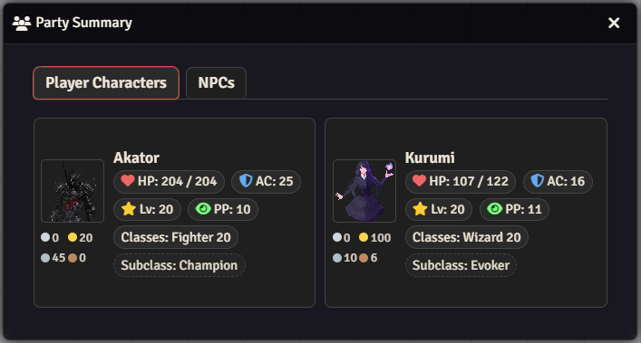
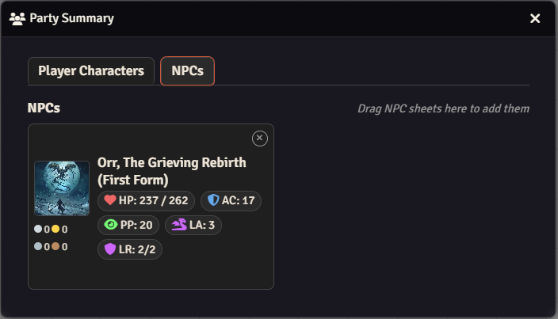

# Party View

A clean, intuitive party overview module for D&D 5e in Foundry VTT that keeps your players' and NPCs' vital information always within reach.

## What is Party View?

Party View adds a **Party Summary panel** to the Actors directory, giving you quick access to all active party members. Perfect for GMs who want instant access to character stats during combat or roleplay without opening individual character sheets.

### Player Characters Tab

### NPCs Tab

## Features

### Quick Character Overview

- **At-a-glance stats**: HP, AC, Level, Passive Perception, and more
- **Currency tracking**: See party wealth at a glance with abbreviated coin displays
- **Legendary tracking**: Displays Legendary Actions, Resistances, and Regeneration abilities

### Dual Tabbed Interface

- **Player Characters tab**: Lists all party members instantly
- **NPCs tab** (GM only): Drag-and-drop NPC management
- **Seamless switching**: Keep track of enemies alongside allies

### Customizable Display

- **Toggle icons**: Show or hide stat icons for a cleaner look
- **Portrait source selection**: Choose between actor portraits or token images
- **Responsive design**: Works at any resolution

### Live Updates

- **Scene-aware**: Pulls token data from your active scene when available
- **Real-time refresh**: Updates reflect actor changes instantly
- **Manual refresh**: Reopen Party Summary to force a sync

## Settings

Access settings from your Foundry module configuration:

| Setting                          | Default        | Effect                                             |
| -------------------------------- | -------------- | -------------------------------------------------- |
| **Show Icons**                   | On             | Display stat icons in party cards                  |
| **Portrait Source**              | Actor Portrait | Choose between character portraits or token images |
| **Allow Players to View PC Tab** | Off            | Let non-GM players see the party overview          |

## D&D 5e Support

Party View is built specifically for D&D 5e and displays:

- Armor Class (AC)
- Hit Points (HP) with Temporary HP tracking
- Character Level
- Passive Perception (for stealth and surprise checks)
- Character Classes and Multiclassing
- Coin and currency totals
- Legendary Actions and Resistances
- Regeneration abilities

## License

Licensed under the MIT License - see the [LICENSE](LICENSE) file for details.

## Support

Found a bug? Report it on [GitHub Issues](https://github.com/GalloFrancesco04/partyview/issues) and i'll be happy to take a look at it.

---

Made for Foundry VTT
